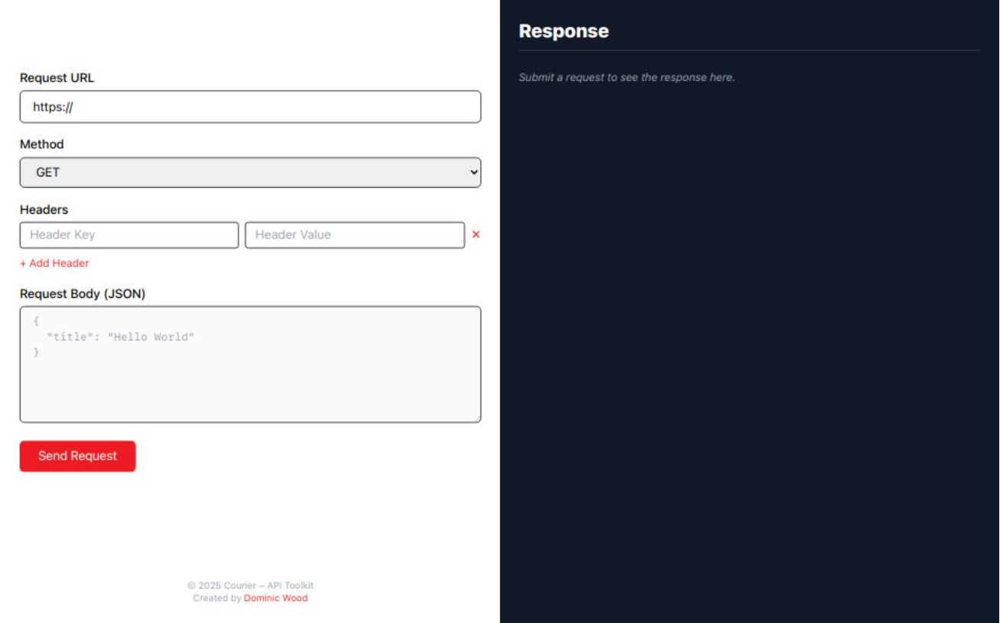
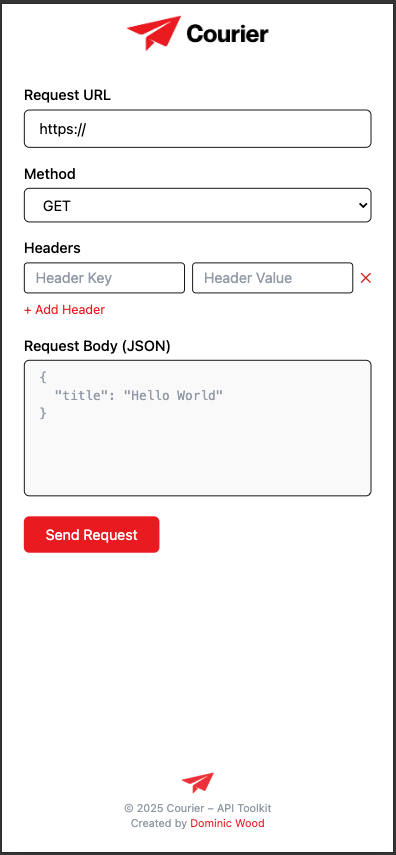
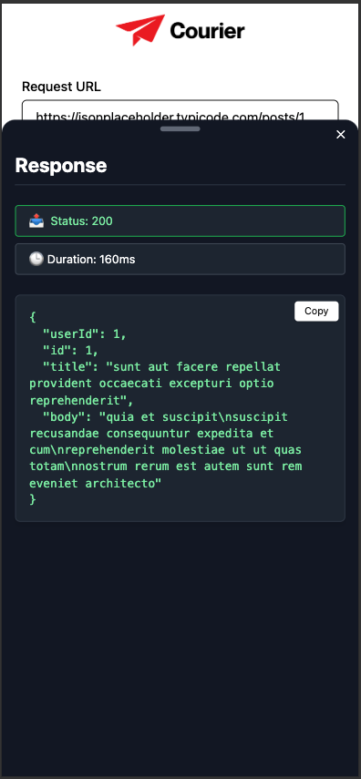

# Courier – API Toolkit 🔺
Courier is a lightweight Postman-style API testing client built using React, TypeScript, and Tailwind CSS.

It offers a clean, responsive interface for quickly sending HTTP requests and viewing results — all with a crisp Courier-red design. 🔥


🔗 **Live Site**: [courierapi.vercel.app](https://courierapi.vercel.app)

## 🚀 Features

- 🔗 Supports `GET`, `POST`, `PUT`, `DELETE`, `PATCH`
- 📦 Custom header inputs
- 📝 JSON body input (disabled for `GET`)
- ⚡ Request duration timing
- ✅ Status code response
- ❌ Error handling + display
- 📋 Copy to clipboard
- 📱 Fully responsive design with mobile bottom sheet viewer
- 🎨 Courier-branded UI (`#ed1c24` red + bold type)

## 📸 Screenshots
### 🖥️ Desktop View


### 📱 Mobile View



## 🛠️ Tech Stack

- ⚛️ React 19 + TypeScript
- 🎨 Tailwind CSS
- ⚡ Vite
- 📦 Hosted via Vercel

---

## 📷 Quick Walkthrough

### Example Request

| Field        | Example                                |
|--------------|----------------------------------------|
| **URL**      | `https://jsonplaceholder.typicode.com/posts/1` |
| **Method**   | `GET`                                  |
| **Headers**  | `X-Test-Header: CourierDemo`           |

### POST Example

| Field        | Value                                  |
|--------------|----------------------------------------|
| **URL**      | `https://jsonplaceholder.typicode.com/posts` |
| **Method**   | `POST`                                 |
| **Body**     | `{"title": "Courier is amazing"}`      |

---

## 🧪 Getting Started


### 1. Clone the repo
```bash
git clone https://github.com/dominic-wood/courier.git
cd courier
```
### 2. Install dependencies
```bash
npm install
```
### 3. Start the dev server
```bash
npm run dev
```
## 🧼 File Structure

```plaintext
src/
  components/
    BottomSheet.tsx
    HeaderBar.tsx
    RequestForm.tsx
    ResponseViewer.tsx
  App.tsx
  main.tsx
  index.css
public/
  courier-logo.png
  courier-icon.png
  favicon.ico
```

## 🛣️ Roadmap
- 🔁 Request history (localStorage)
- 🔐 Auth helpers (Bearer / Basic)
- 🎛️ Theme toggle
- 💾 Export/import request configs
- 🌍 Environment & variable support
- 🔍 Auto-format JSON

## 🧾 License
MIT — Use it, fork it, build on it, break it.  
Created by Dominic Wood

## 🔗 GitHub Repo

[View on GitHub](https://github.com/dominic-wood/courier)

[← Back to Projects](../projects.md)
