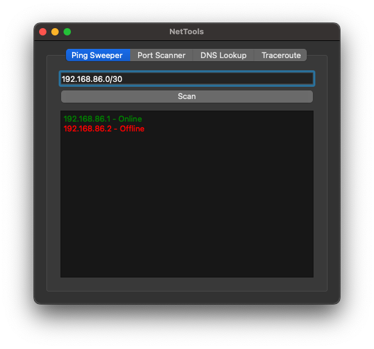
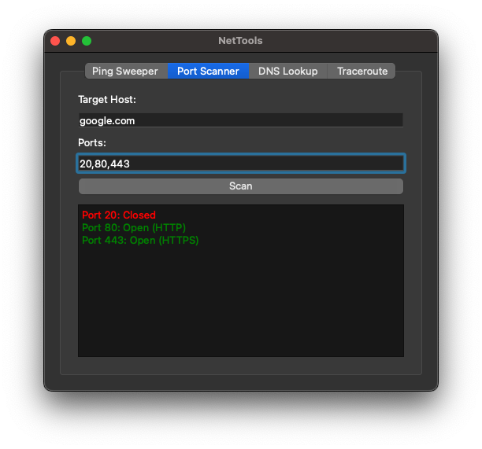
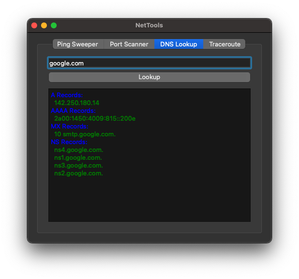
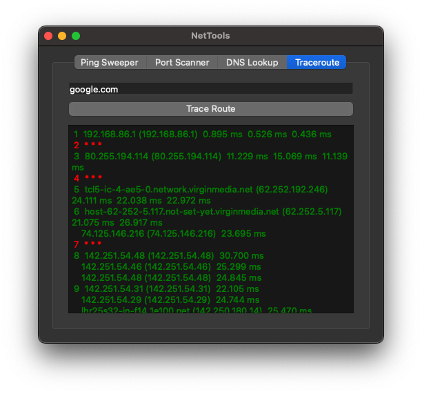

# NetTools - Network Utility Suite 🛠️🌐

**NetTools** is a Python-based GUI app that brings together key network tools in a simple, user-friendly interface. It’s built for sysadmins, students, and curious tinkerers who want quick access to useful diagnostics.

## 🚀 Features

### 🔍 **Ping Sweeper**
Scan a local subnet and find live hosts with a threaded ping utility.

### 🔐 **Port Scanner**
Check for open ports on a given host (e.g. 22, 80, 443). Fast, threaded, and color-coded for quick results.

### 🌐 **DNS Lookup**
Get **A**, **AAAA**, **MX**, and **NS** records for any domain using the **dnspython** library.

### 🧭 **Traceroute**
Trace the path your connection takes to reach a domain or IP. View each hop, including IPs, hostnames, and response times.

## 📸 Screenshots

---

## 🧱 Tech Stack

- **Python 3.13+**
- **PySide6** – GUI framework
- **dnspython** – DNS queries
- **`socket`, `ipaddress`, `concurrent.futures`** – Network logic

## ✍️ About

This project combines my background in networking and software development with a love for clean, clear tool design. NetTools is built to be practical, easy to understand, and useful.

## 🔗 GitHub Repo

[View on GitHub](https://github.com/dominic-wood/nettools)