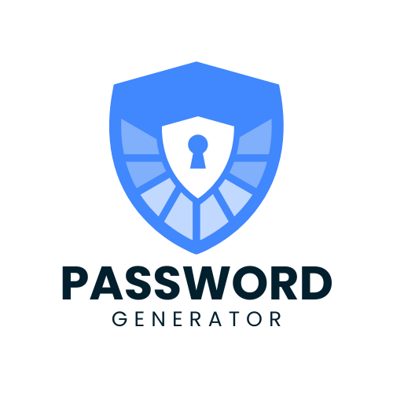
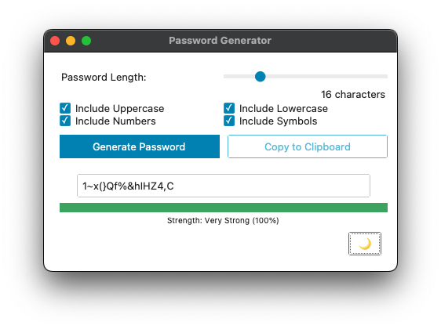
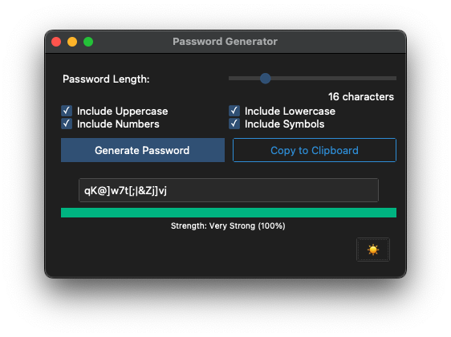

# 🔐 Password Generator

A modern, easy-to-use password generator built with Python and a sleek GUI using [ttkbootstrap](https://ttkbootstrap.readthedocs.io/).

Quickly generate secure, customizable passwords with live strength feedback and a clipboard copy feature.



## 🚀 Features

- 📏 Adjustable password length via slider  
- 🔤 Toggle character options:
  - Uppercase letters
  - Lowercase letters
  - Numbers
  - Symbols  
- ⚡ Real-time password updates  
- 🔁 Manual **Generate Password** button  
- 📋 One-click **Copy to Clipboard**  
- 📶 Live password strength meter with dynamic color feedback  
- 🌗 Icon toggle for light/dark mode


## 🖼️ Interface

| Light Mode | Dark Mode |
|---|---|
|  |   |

## 🚀 Getting Started

### 📦 Requirements

- Python 3.8 or newer  
- [`ttkbootstrap`](https://pypi.org/project/ttkbootstrap/)

### 🛠️ Install Dependencies

```bash
pip install ttkbootstrap
```

### ▶️ Run the App
```bash
python main.py
```

## 💡 Usage Tips

- Adjust the **length slider** or toggle any character option — a new password will be generated instantly  
- Click **Generate Password** to refresh manually without changing settings  
- Use **Copy to Clipboard** to instantly copy the password to your clipboard for easy pasting  
- Tap the 🌙/☀️ icon in the corner to toggle themes

## 🤝 Contributing

Suggestions and improvements are always welcome!  
Feel free to open an issue or submit a pull request.

## 📄 License

This project is licensed under the MIT License.

## 🔗 GitHub Repo

[View on GitHub](https://github.com/dominic-wood/password-generator)

[← Back to Projects](../projects.md)
