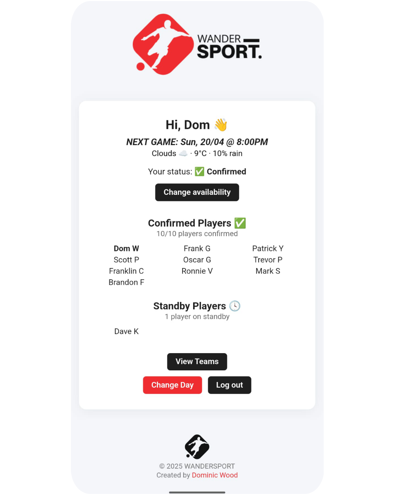

# WanderSport ⚽
 **WanderSport** is a lightweight web app for tracking weekly football availability. Players can register, log in, and mark their status for the next game. Confirmed players and standbys are tracked in real time, and automated emails notify players when they’re promoted from standby.


## 🌍 Live Demo
[wander-sport.co.uk](https://wander-sport.co.uk)



## 🧰 Tech Stack

|**Layer** | **Stack** |
|---|---|
| **Frontend** | React + Vite |
| **Backend** | Node.js + Express |
| **Database** | PostgreSQL (Render)|
| **Auth** | JWT + Bcrypt |
| **Email** | Nodemailer (Gmail SMTP) |
| **Deploy** | Vercel (Frontend) + Render (Backend) |

## 🚀 Features

- 🔐 User Authentication
    - Register and log in with hashed passwords and JWT-based sessions.
- ✅ One-Click Availability
    - Confirm or cancel your attendance instantly.
- ⏳ Standby Queueing
    - Extra players are automatically placed on standby and promoted if a slot opens.
- 📧 Smart Email Alerts 
    - Players are notified when they're promoted from standby to confirmed.
- 📅 Dynamic weekly scheduling
    - Availability is tracked by game and updated automatically for the next upcoming match.
- 🧠 Game-Specific Logic
    - Choose between Sunday 5s or Wednesday 7s, each with their own player limits and logic.
- ⚡ Real-Time Updates
    - Availabilities and player counts update every few seconds.
- 👥 Team Generator
    - When enough players are confirmed, you can randomly generate two balanced teams with a single click.
- 📱 Mobile-Friendly
    - Optimized for mobile, with PWA-style installability.

## 📦 Setup
### 1. Clone the repo

```bash
git clone https://github.com/dominic-wood/wandersport.git
cd wandersport
```
### 2. Backend
```bash
cd server
npm install 
```
Add the following to your `.env` file:
```ini
SMTP_USER=your_email@gmail.com
SMTP_PASS=your_app_password
JWT_SECRET=supersecret
```
Run locally:
```bash
node index.js
```
### 3. Frontend
```bash
cd ../client
npm install
```
Add this to .env.local (for local dev):
```bash
VITE_API_URL=http://localhost:3001/api
```
Run locally:
```bash
npm run dev
```

## 🧼 Planned Improvements
- Admin panel to edit player names, status, or remove players
- Weekly reminders via email
- Auto-team assignment logic
- Game history and past lineups
- Dark mode support

## 🧾 License
MIT — Use it, fork it, build on it, break it.  
Created by Dominic Wood

## 🔗 GitHub Repo

[View on GitHub](https://github.com/dominic-wood/wandersport)

[← Back to Projects](../projects.md)
